# Architecture Diagrams for Presentation

## 1. High-Level System Architecture

```mermaid
flowchart TB
    subgraph UserLayer [User Interface]
        User[👤 User Input<br/>Chrome Extension or API Client<br/>Submits claims for verification]
    end
    
    subgraph APILayer [API Layer]
        API[🚀 FastAPI REST Server<br/>Port 8000<br/>Validates requests & routes to agent]
    end
    
    subgraph AgentLayer [Intelligent Agent Core]
        Agent[🤖 LangGraph Agent<br/>6-Node State Machine<br/>Decision Logic:<br/>• Try local RAG first<br/>• If confidence < 0.7 OR no results → Web search<br/>• Store web results back to RAG]
    end
    
    subgraph DataSources [Knowledge & Search Sources]
        RAG[(📚 ChromaDB Vector Store<br/>• Hybrid: Vector + BM25<br/>• FlashRank re-ranking<br/>• Self-improving storage)]
        LLM[🧠 OpenAI GPT-4o<br/>• Evidence evaluation<br/>• Confidence scoring: 0.0-1.0<br/>• Structured output]
        Web[🌐 Tavily Search API<br/>• Real-time web search<br/>• Returns 5 sources<br/>• With URLs for citation]
    end
    
    User -->|POST /verify| API
    API --> Agent
    
    Agent <-->|Query & Retrieve| RAG
    Agent <-->|Evaluate & Score| LLM
    Agent <-->|Search when needed| Web
    
    API -->|verdict + confidence + source URLs| User
    
    style UserLayer fill:#e3f2fd
    style APILayer fill:#fff3e0
    style AgentLayer fill:#f3e5f5
    style DataSources fill:#e8f5e9
    style User fill:#e3f2fd
    style API fill:#fff3e0
    style Agent fill:#f3e5f5
    style RAG fill:#e8f5e9
    style LLM fill:#fce4ec
    style Web fill:#e0f2f1
```



## 2. Request Flow Diagram


## 3. Hybrid Retrieval Pipeline


## 4. Self-Improving Knowledge Base

```mermaid
sequenceDiagram
    participant User
    participant Agent
    participant RAG as ChromaDB
    participant Web as Tavily
    
    Note over User,Web: First Query (Topic X)
    User->>Agent: Verify Claim
    Agent->>RAG: Search Local KB
    RAG-->>Agent: No Results
    Agent->>Web: Search Web
    Web-->>Agent: 5 Results + URLs
    Agent->>RAG: Store with Metadata
    Agent-->>User: Verdict + Source URLs
    
    Note over User,Web: Second Query (Same Topic)
    User->>Agent: Similar Claim
    Agent->>RAG: Search Local KB
    RAG-->>Agent: ✅ Found Cached Data
    Agent-->>User: Fast Response<br/>(No Web Search)
```



## 5. Data Storage with Source Attribution


## 6. Complete Agent Graph (Detailed)

```mermaid
flowchart TB
    Start([🎯 START<br/>User Claim])
    
    Retrieve[📥 Node 1: Retrieve<br/>━━━━━━━━━━━━━━<br/>Vector Search Top 20<br/>BM25 Keyword Top 20<br/>Fusion + Re-rank → Top 5]
    
    EvalRAG[🧠 Node 2: Evaluate RAG<br/>━━━━━━━━━━━━━━<br/>GPT-4o analyzes evidence<br/>Returns: confidence score<br/>+ verdict + reasoning]
    
    Route{🔀 Node 3: Route<br/>━━━━━━━━━━━━━━<br/>evidence_found?<br/>AND<br/>confidence > 0.7?}
    
    WebSearch[🌐 Node 4: Web Search<br/>━━━━━━━━━━━━━━<br/>Tavily API<br/>5 results with URLs]
    
    EvalWeb[🧠 Node 5: Evaluate Web<br/>━━━━━━━━━━━━━━<br/>GPT-4o analyzes web data<br/>Extract source URLs]
    
    Sync[💾 Node 6: Sync to RAG<br/>━━━━━━━━━━━━━━<br/>Store each result with:<br/>source_url + title<br/>+ metadata in ChromaDB]
    
    Format[📦 Format Output<br/>━━━━━━━━━━━━━━<br/>verdict + confidence<br/>+ source URLs<br/>+ evidence source]
    
    End([✅ END<br/>Return Response])
    
    Start --> Retrieve
    Retrieve --> EvalRAG
    EvalRAG --> Route
    
    Route -->|✅ YES<br/>High Confidence| Format
    Route -->|❌ NO<br/>Need more data| WebSearch
    
    WebSearch --> EvalWeb
    EvalWeb --> Sync
    Sync --> Format
    
    Format --> End
    
    style Start fill:#e3f2fd,stroke:#1976d2,stroke-width:3px
    style End fill:#e8f5e9,stroke:#388e3c,stroke-width:3px
    style Route fill:#fff3e0,stroke:#f57c00,stroke-width:3px
    style EvalRAG fill:#fce4ec,stroke:#c2185b,stroke-width:2px
    style EvalWeb fill:#fce4ec,stroke:#c2185b,stroke-width:2px
    style Retrieve fill:#e8eaf6,stroke:#3f51b5,stroke-width:2px
    style WebSearch fill:#e0f2f1,stroke:#00796b,stroke-width:2px
    style Sync fill:#f3e5f5,stroke:#7b1fa2,stroke-width:2px
    style Format fill:#fff9c4,stroke:#f9a825,stroke-width:2px
```


    style EvalWeb fill:#fce4ec
```

## 7. Tech Stack Overview


## 8. API Response Structure


---

## Usage Instructions

1. Copy any diagram above
2. Paste into a Mermaid renderer:
   - https://mermaid.live/ (online editor)
   - VS Code with Mermaid extension
   - Notion, GitHub, or any Mermaid-compatible tool
3. Export as PNG/SVG
4. Insert into PowerPoint

## Recommended Diagrams for Presentation

- **Slide 1 (Overview)**: Diagram #1 - High-Level System Architecture
- **Slide 2 (Flow)**: Diagram #2 - Request Flow Diagram  
- **Slide 3 (Innovation)**: Diagram #3 - Hybrid Retrieval Pipeline
- **Slide 4 (Self-Improvement)**: Diagram #4 - Self-Improving Knowledge Base
- **Slide 5 (Technical)**: Diagram #6 - Complete Agent Graph
